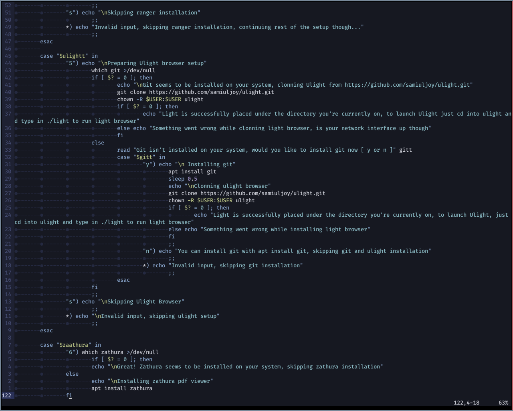
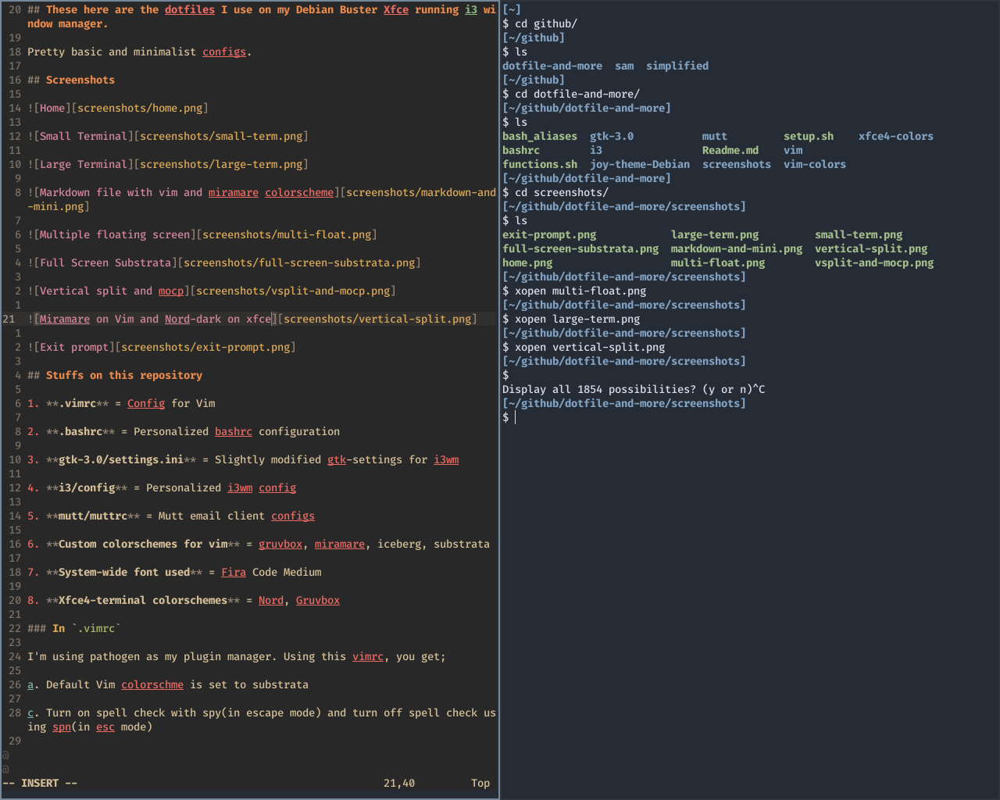

## These here are the dotfiles I use on my Debian Buster Xfce running i3 window manager.

Pretty basic and minimalist configs. 

## Screenshots

## Stuffs on this repository

1. **.vimrc** = Config for Vim

2. **.bashrc** = Personalized bashrc configuration

3. **gtk-3.0/settings.ini** = Slightly modified gtk-settings for i3wm

4. **i3/config** = Personalized i3wm config

5. **mutt/muttrc** = Mutt email client configs

6. **Custom colorschemes for vim** = [gruvbox](https://github.com/morhetz/gruvbox), [miramare](https://github.com/franbach/miramare), [iceberg](https://github.com/cocopon/iceberg.vim), [substrata](https://github.com/arzg/vim-substrata)

7. **System-wide font used** = Fira Code Medium

8. **Xfce4-terminal colorschemes** = [Nord](https://github.com/arcticicestudio/nord-xfce-terminal), [Gruvbox](https://gist.github.com/tsbarnes/76724165773e834ea90c), Nord-dark

9. **Debian Joy Theme wallpapers included under joy-theme-debian** 

### In `.vimrc`

I'm using pathogen as my plugin manager. Using this vimrc, you get;

a. Default Vim colorschme is set to substrata(remember to copy vim-colors/substrata.vim to /usr/share/vim/vim\*/colors/)

c. Turn on spell check with spy(in escape mode) and turn off spell check using spn(in esc mode)

d. Spell check is turned on automatically for markdown files or files having `.md` extension and default colorschme for markdown files is set to miramare

e. Page down with space

f. Miscellaneous: syntax is enabled, laststatus is set to 0, termguicolors is enabled, noswapfile is set, background is set to dark, relativenumber and numbers are on, and cursorline in set to true, which highlights the line you're currently on.

g. Although optional, if you're not using w and q for their defined actions, you can map them to save and quit, just uncomment line 5 and 6, save vimrc. Now, you can exit vim with q and save with w. Easy as that.

### Stuffs in `.bashrc and bash_aliases`

a. A few of aliases and color profiles in .bash_aliases for specific file formats.

b. A cs function at the end. Type in `cs directory` and it'll cd to that directory and list out its contents

### In gtk-3.0/

If you're using i3, font's by default don't have antialiased and hinting enabled and gui applications open in default bright themes, hence, to enable dark colorschme and antialising and hinting, these settings have been included. You'll have to manually place the settings under $HOME/.config/gtk-3.0/settings.ini.

### Stuffs in `i3/config`

**Default $mod key is set to Super**

a. Increase/Decrease system volume with F9 and F8 and toggle mute with F10

b. Switch between recent work-spaces with alt+tab (work-space auto back and forth is enabled)

c. Default terminal is set to xfce4-terminal

d. alt+home opens firefox on workspace 2

e. Kill a window with $mod+q

f. alt+f starts thunar file manager in floating mode

g. alt+Return(or enter) opens up a floating terminal screen with title mango

h. If you have `moc` music player, hitting alt+p will bring up mocp music player.

i. Appearance of `dmenu` has been customized

j. Hitting $mod+shift+e will bring out the exit prompt.

k. Status bar is completely empty and hidden. Press alt to see an empty status bar. I like empty status bar (:

l. focus_follows_mouse is set to false

m. Open applications like thunar light, firefox, parole etc in their customized floating sizes.

n. Take screenshots with <Print> key on your keyboard

### Stuffs in `$HOME.config/mutt/muttrc`

Mutt is an email client. Make sure to lock store your password in a different file and encrypt it with gpg key. There's also a gruvbox colorschme included.

### Custom colorschemes for vim

This here are some custom colorschemes for vim. Gruvbox, Substrata, Iceberg, Miramare

### System-wide Font I used

Fira Code Medium is the font I'm currently using.

### Xfce4-terminal colorschme

Gruvbox and Nord are two colorschemes I switch back and forth. I mostly end up using Nord. The colorschemes are under xfce4/xfce4-colors/

## Setting Everything up

### Manual setup

1. Replace vim/vimrc with your .vimrc under your home directory, it's best not to replace it with the one on /etc/vim/vimrc.

3. Replace the bashrc and bash_aliases with the .bashrc and .bash_aliases on your home directory.

4. Place the gtk-3.0/settings.settings.ini on $HOME/.config/gtk-3.0/settings.ini. 

5. If you're using i3wm, replace the config under $HOME/.config/i3/config with the config of this repository. 

6. If you plan on using Mutt, you can replace the muttrc under $HOME/.config/mutt/muttrc with the config on mutt/muttrc of this repository. I've also included a gruvbox-colorscheme.muttrc for mutt. If you wish to use this colorscheme, you'd have to put that under $HOME/.config/mutt/ as well.

7. Replace the vim colorschemes from vim-colors/ to /usr/share/vim/vim\*/colors/

8. Downlaod font-fira-code with `apt install fonts-firacode` or head over to https://packages.debian.org/search?keywords=fonts-firacode and download from there, whatever suits you.

9. If you're using xfce4-terminal, you can replace the colorschemes from xfce4-colors eg: nord.theme under /usr/share/xfce4/terminal/colorschemes/

### Automatic setup

Clone the repo, cd into dotfiles-and-more/ and run setup.sh. Some of the steps require you to have administrative privilege and is left for you to install manually if setup.sh is not executed as root.
